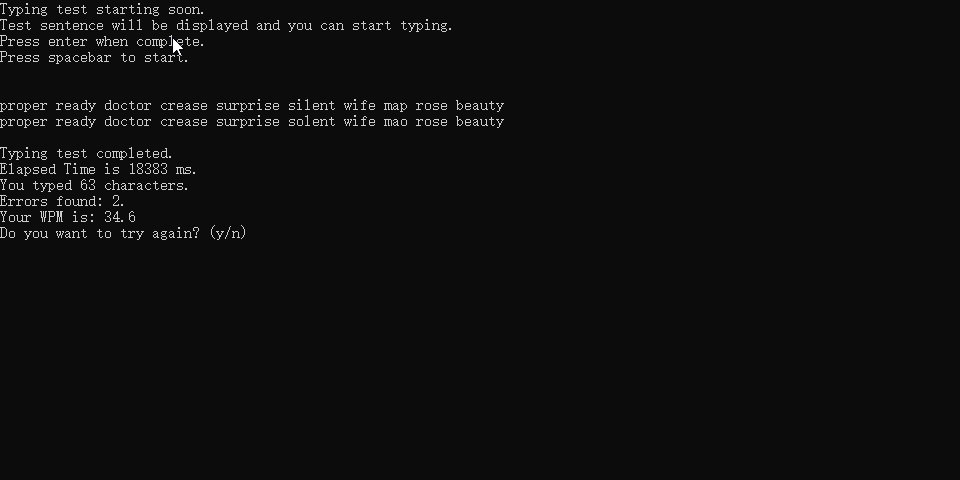

# typingtestapp
This is a simple console application built in C# to test your typing speed. 

If you press enter before you complete typing every word the remaining untyped letters will not be counted in the WPM calculation.

Change the options in the config.json file to change the number of words per test and if you have a different list of words txt file you want to use.

